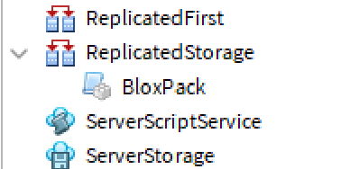
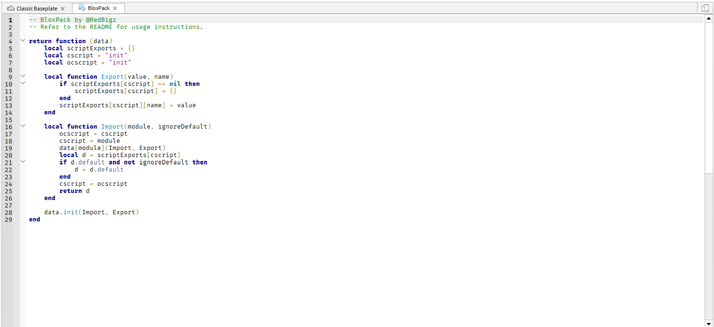

# BloxPack
BloxPack is a tool for Roblox which packs a collection of lua files into a simple script.

## Installing in your Roblox Game
1. Create a ModuleScript in ReplicatedStorage named "BloxPack"


2. Paste the code inside [`bloxpack.lua`](https://github.com/RedBigz/BloxPack/blob/main/bloxpack.lua) into the script.


## Syntax of BloxPack
### Directory Tree
Here is the directory tree of a BloxPack Folder:
```
.
└── example_folder/
    ├── init.lua
    └── <insert other scripts here>
```
BloxPack folders must contain an `init.lua` file.

### Export & Import
To import a module, you would type the following into your script:
```lua
local module = require("module");
```
To export a variable, you would type the following into your script:
```lua
--@Export variable
```
To export a variable as the default, you would type the following into your script:
```lua
--@ExportDefault variable
```

## Compiling a BloxPack Folder
Type the following into your command line:
```powershell
bloxpack <DIRECTORY> -o <OUTPUT FILE>
```
An example:
```powershell
bloxpack ./examples/helloworld -o ./helloworld.lua
```